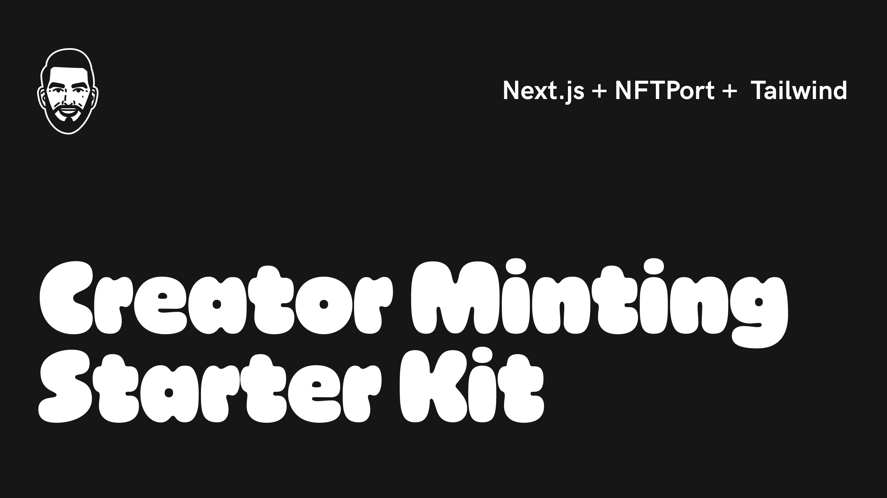

# NFTPort NFT Minting Starter Kit

This is a starter kit for minting NFTs directly to a Web3 wallet address using [NFTPort](https://www.nftport.xyz/), Next.js's [`create-next-app`](https://github.com/vercel/next.js/tree/canary/packages/create-next-app), and [Tailwind](https://tailwindui.com/); additionally, it is deployable on [Vercel](https://vercel.com/).

## Getting Started

### Step 1

Wagmi requires an infrastructure provider for connecting Web3 wallets to this applicaton (ex. MetaMask). 

To use Alchemy, complete the following steps:

1. [Sign-up](https://www.alchemy.com/) and create an Alchemy account
2. Create an app
3. Copy and save the app's API key

### Step 2

For minting, this app uses NFTPort's [Easy Minting with File Upload API](https://docs.nftport.xyz/docs/nftport/b3A6Njg1NTI0Mjc-easy-minting-w-file-upload). 

To use NFTPort, complete the following steps:

1. [Sign-up](https://dashboard.nftport.xyz/sign-up) and create an NFTPort account
2. After signing-up, copy and save the accounts [API Key](https://dashboard.nftport.xyz/api-key)

### Step 3

Using your Alchemy and NFTPort API keys, complete the following steps to run this application:

1. Clone this repository
2. Copy `.env.sample` and rename it to `.env`
3. Update your environment variables file (`.env`) using your NFTPort API Key and other information about your NFT project
4. Run `npm run dev`
5. View your landing page on `localhost:3000`

### Deploying with Vercel

Alternatively, this application can be deployed using Vercel's [Deploy Now](https://vercel.com/docs/deploy-button):

Note, deploying to Vercel does not require any knowledge of Javascript, Next.js or software development; however, all required environment variables are needed to successfully deploy this application.

## Environment Variables

The list of environment variables needed to run this application:

| Variable        | Description           | Example  |
| ------------- |-------------| -------------|
| NEXT_PUBLIC_ALCHEMY_API_KEY      | Alchemy API Key      |   JHhg267hpy2iOPxcxPOLImqjM8OiZqcwas |
| NEXT_PUBLIC_NFTPORT_API_KEY      | NFTPort API Key      |   4806f51a-f91f-456d-8cb6-b471b909c2b6 |
| NEXT_PUBLIC_NFTPORT_MINTING_CHAIN     | Blockchain to mint to      |   `goerli` or `polygon` |

## Roadmap

This repository is just a starter kit, but I will be expanding it to include:

- [ ] Allow connected wallets to link their social media account (ex. Instagram)
- [ ] Allow connected wallets to mint content from their linked social media account (ex. last Instagram post)
- [ ] Who really knows (wink, wink)

## Contributing

Feel free to fork, submit pull requests and contribute.

## Questions

If you have any questions, feel free to email me at: [sergio.m.villasenor@gmail.com](mailto:sergio.m.villasenor@gmail.com).